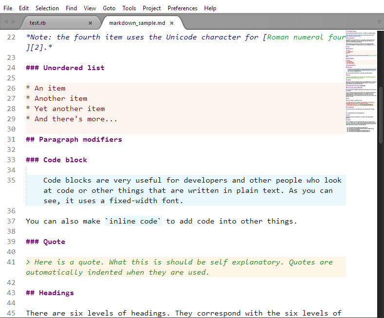
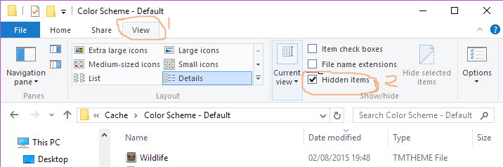
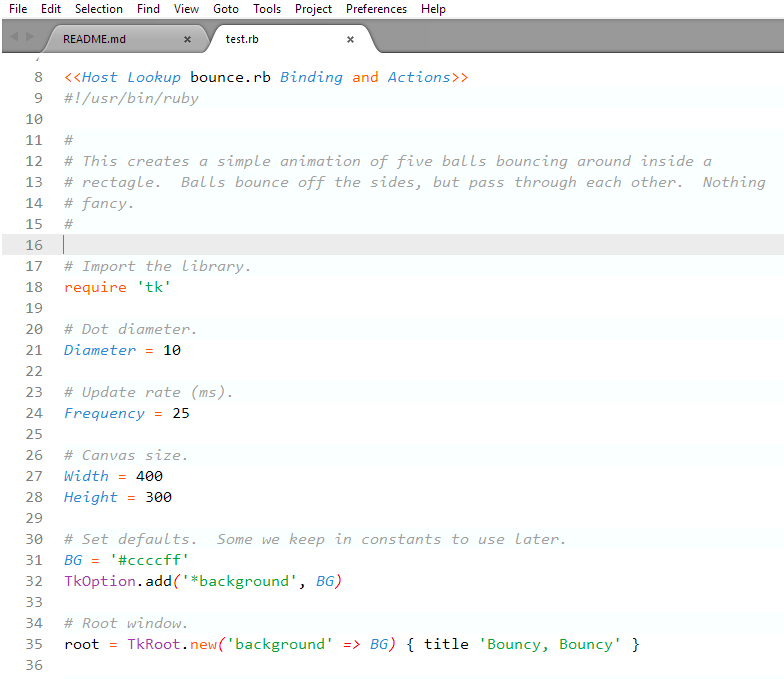

#Wildlife Sublime Theme

## About
Wildlife theme uses colourful Syntax highlighting for Sublime text 2 and 3 for languages ranging from:

* Python
* Ruby
* Restructured Text, Markdown
* HTML, CSS
* Matlab
* JSON
* Other languages included

with inspiration from the Idle built-in theme and the Mac Classic.

## Installation
s
Open `Tools -> Command Palette...`. Search for `Package Control: Install Package` and click enter. Wait for
the available packages to show up and then search for `Wildlife Color theme`. Click enter and the theme should
be installed.

### Using Git

Locate your Sublime Text 2 `Packages` directory by using the menu item `Preferences -> Browse Packages...`.

While inside the `Packages` directory, clone the theme repository using the command below:

    git clone https://github.com/tushortz/wildlife-theme.git

### Download Manually

* Download the files using the GitHub .zip download option
* Unzip the files
* Copy the folder to your Sublime Text 2 `Packages` directory

## Activating the color theme

`Preferences -> Color Scheme -> Wildlife`.

optionally

##For windows
### for Sublime text 2
copy the **Wildlife.tmTheme** and paste the file into the location of your default color scheme. It should be found by opening sublime text then clicking `preferences -> Color Scheme - Default `

then go to the menubar and click `preferences -> Color Scheme - Default` and choose Wildlife as the default theme

### For Sublime text 3
copy the **Wildlife.tmTheme** and paste the file into the following location.

> **Note:** You will need to *show hidden files* first
> 

####File location
*C:\Users\ **User name**\AppData\Local\Sublime Text 3\Cache\Color Scheme - Default*

## Contributing

All contributions are welcome. 

## License
© 2015 Taiwo Kareem | taiwo.kareem36@gmail.com.

This is free software. It is licensed under the MIT License. Feel free to use this in your own work. However, if you modify and/or redistribute it, please attribute me in some way, and it would be great if you distribute your work under this or a similar license, but it's not required.

## Acknowledgements
I'd first like to say a very big thank you to God my creator. Without him, this wouldn't be possible. Secondly, to <a href="https://github.com/MattDMo">Matt Morrison </a> for inspiration from his code for nested JSON objects *(i guess)* syntax highlighting.

## Other Screenshot

To view others, click on the preview folder and you will see some(not all) other screenshots

