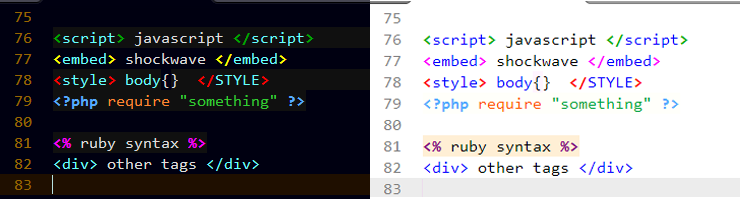
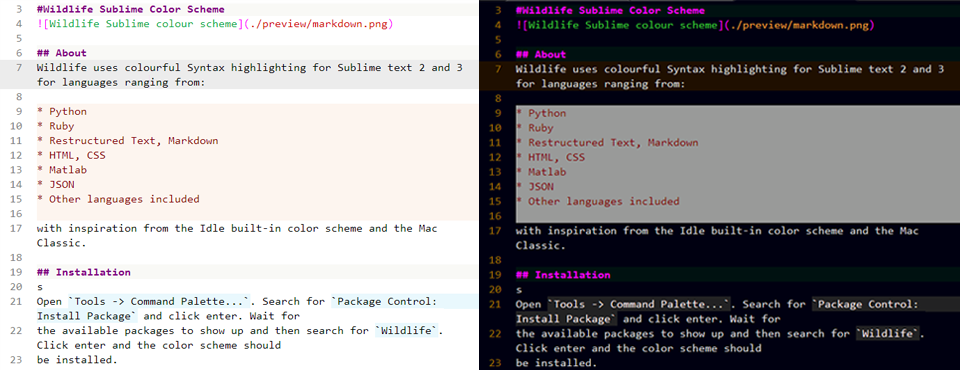
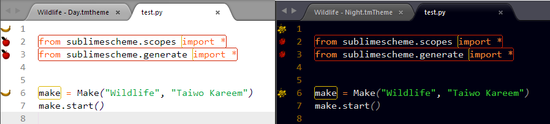
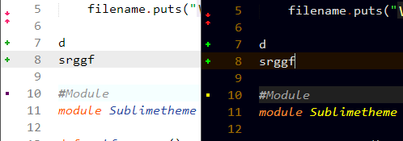
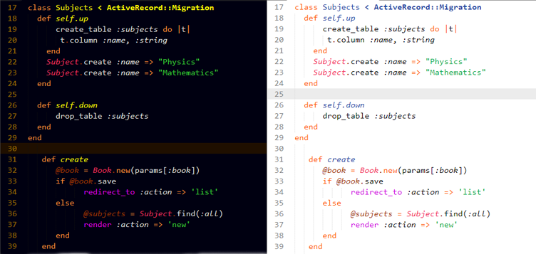
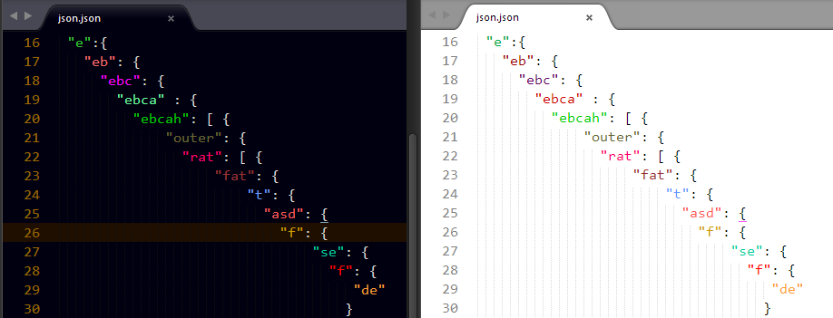

#Wildlife Color Scheme

 

## About
This is a vibrant color scheme with git-gutter and gutter linter support. It supports over 75 languages (See supported languages in the `Supported Languages.txt`). 

### Features

#### Color scheme
It has two options **(Day and Night)** to choose from.

#### Sublime linter support

It has four options to choose from namely:

See <a href="https://github.com/tushortz/Wildlife-gutter-theme"> Wildlife Gutter theme for screenshots.</a>

> **Note:** You don't need to install `Wildlife gutter theme` if you like it as it already comes with Wildlife theme.

#### Git gutter support

It also supports git gutter.

## Installation
See [Installation manual](./messages/installation.txt)  for details.

## Activating the color Scheme
From the menubar, click `preferences -> Color Scheme - Default` and choose any of `Wildlife` two options.

## Contributing

All contributions are welcome. Just Fork it .

## License
© 2015 Taiwo Kareem | taiwo.kareem36@gmail.com.

This is free software. It is licensed under the MIT License. Feel free to use this in your own work. However, if you modify and/or redistribute it, please attribute me in some way, and it would be great if you distribute your work under this or a similar license, but it's not required.

## Acknowledgements
I'd first like to say a very big thank you to God my creator. Without him, this wouldn't be possible. Secondly, to <a href="https://github.com/MattDMo">Matt Morrison </a> for inspiration from his theme on how to highlight nested json strings.

Created using Python's <a href="https://pypi.python.org/pypi/Sublimescheme">Sublime scheme</a>, a version of Ruby's <a href="https://rubygems.org/gems/sublimetheme">Sublime theme</a>. 

## Other Screenshot

 

or check the `preview folder`

